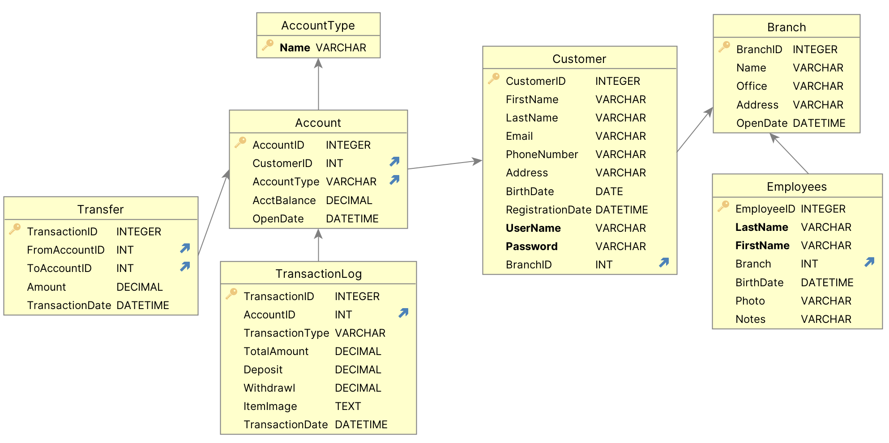

# Quick Start

This is a sqlite version of the Banking application, illustrating more complex logic.

## The database



&nbsp;

# 1. Setup and Run

To run the banking app...

&nbsp;

## 1.1 Establish Your Python Environment - Other Environments

Establish your virtual environment, [like this](https://apilogicserver.github.io/Docs/Project-Env/).

&nbsp;

## 1.2 Run

Then start the server (Run Configurations have already been created):

* For PyCharm, press Ctl-D
* For VSCode, &nbsp;press F5:

&nbsp;

# 2. Test Funds Transfer

The Funds Transfer transaction insert a Tranfer row.

Event logic `fn_transfer_funds` creates 2 `TransactionLog` rows (from/to account), which adjust Customers' `Account.AcctBalance`.

In a terminal window:

```bash
curl -X 'POST' \
  'http://localhost:5656/api/Transfer/' \
  -H 'accept: application/vnd.api+json' \
  -H 'Content-Type: application/json' \
  -d '{
  "data": {
    "attributes": {

      "FromAccountID": 2,
      "ToAccountID": 4,
      "Amount": 3,
      "TransactionDate": "0001-01-01 00:00:00",
      "_check_sum_": "",
      "S_CheckSum": ""
    },
    "type": "Transfer"
  }
}'
```

You should see a console log like this:


&nbsp;

# 3. Implementation

The custom api (cURL target) is in [api/customize_api](api/customize_api.py).

The logic is in [logic/declare_logic](logic/declare_logic.py).

